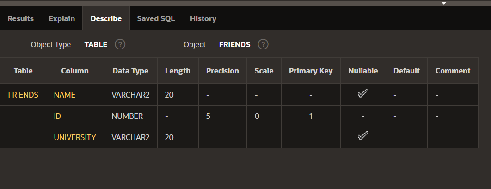
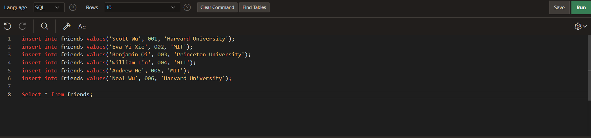
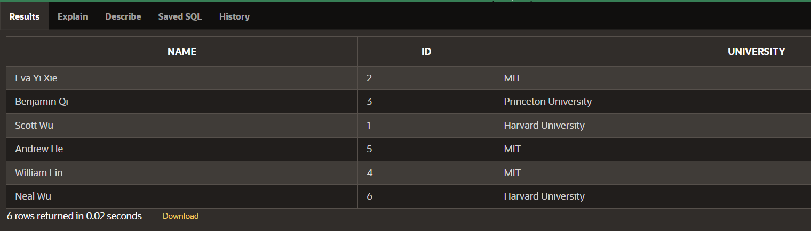
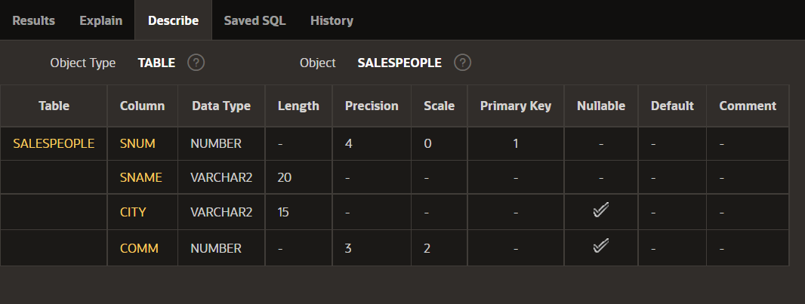
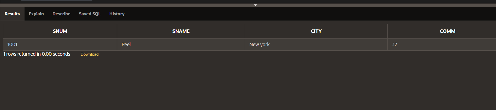
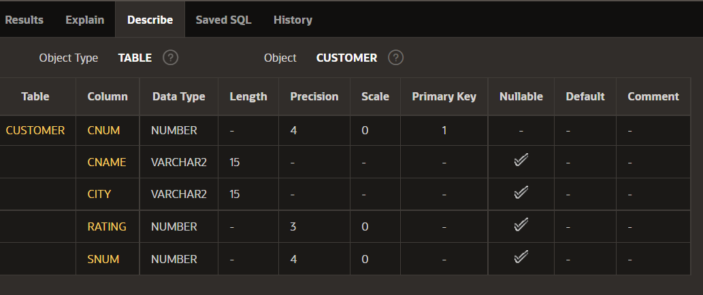
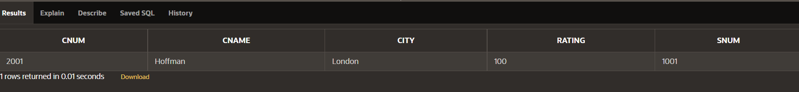
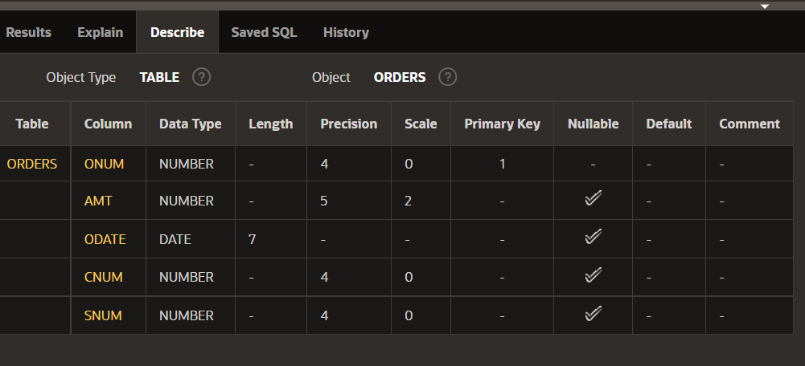
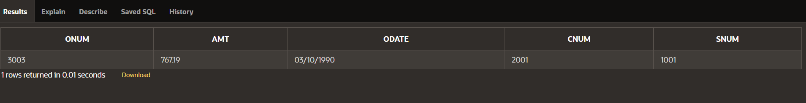

# SQL (Structured Query Language)

Important Points: 
- It always end with a semicolon ";"
- Oracle database is case insensitive it means if you write in capital or small letter or in mixed manner it doesn't matter it will understand what query you are giving him to understand.


In our laboratory we have 2 tables already created in the name of EMP and DEPT. So we have to create another in different names as your wish.

To view the description of the table it means to watch which variable it is or is it null or not or if it is primary or foreign key.
<hr>

## SQL commands

I have a friends table in my own database I will take that example and show the whole process.

- Again LetterCase doesn't matter in Oracle. 

### 1.) Describing a table 
```
DESC friends;
```
Result: 

It means describe friends table.
To run any commands in the SQL is select that query and then click on that green run button. It will automatically take it.

### 2.) How to create a table 

```
Create table friends(
name varchar2(20),
ID NUMBER(5) Primary key,
University Varchar2(20)
);
```
It is how the table is created. The name, id, university these are all the names of the columns in the table. Then you can run ``` desc table_name``` and run it then you will get your prototype of the table what you have the created.

- Here for string storing variables we will use VARCHAR2 or varchar2 or Varchar2 datatype[case doesn't matter]. In the older version of the Oracle we have char or CHAR
- For the integer storing serial-row in the table we will use the NUMBER or number datatype. 
- For storing the date we will use only DATE datatype.
- If that field is a special one like primary key or foreign key write that beside it. If it contains null then write it.

### 3.) How to insert data in the table

```
Syntax:- insert into table_name values(Put your values according to your table);
```
Example: 

```
insert into friends values('Scott Wu', 001, 'Harvard University');
```
```
insert into friends values('Eva Yi Xie', 002, 'MIT');
```
```
insert into friends values('Benjamin Qi', 003, 'Princeton University');
```
```
insert into friends values('William Lin', 004, 'MIT');
```
```
insert into friends values('Andrew He', 005, 'MIT');
```
```
insert into friends values('Neal Wu', 006, 'Harvard University');
```
Show: 



You have to insert one by one and then select one by one to run it and getting the results.


If you have given everything correct in the values after running in the results it will show ```table created 0.0 secs```.

### 4.) How to view the table 
Syntax:- 
```
 select * from table_name;
```
Results:- 


That green ```Download``` click on it to download it and the file it will be saved is table_name.csv but we have to convert it into the excel format name like table_name.xslx

<hr>

**Data Defination Language**: It is used for the defining the structure of table. The commands which will be commonly used is: CREATE, ALTER, DROP.
- **CREATE**: Creation of the Table, fields, etc in the database.
- **ALTER**: Changing in the existing table.
- **DROP**: Deleting the whole/entire fields.

**Data Manipulation Language**: If we want to change in the existing data in the database.<br>
The commands commomly used in the DML is: INSERT, UPDATE, DELETE.

**Data Query Language**:  performing queries on the data within schema objects.<br>
The commonly used commands are: SELECT 

**Transaction Control Language**: If we are the owner of the table then we can give the permission to others to insert, delete and other operations.<br>
The commonly used commands is: GRANT, REVOKE.

<hr>

In the class we have created 3 tables which are seen in the theory-class: Salespeople, Customer, Orders

### For Salespeople Table

```
create table salespeople(
    SNUM number(4) primary key,
    SNAME varchar(20) not null,
    CITY varchar(15),
    COMM number(3,2)
);

DESC Salespeople;

insert into salespeople values(1001,'Peel','New york',0.12);

select * from salespeople;
```
describing the table:

viewing the table[after inserting one value]:


### For Customer Table

```
create table customer(
    CNUM number(4) primary key,
    CNAME varchar2(15),
    CITY varchar2(15),
    RATING number(3),
    SNUM number(4) references salespeople(SNUM) on delete cascade
);

desc customer;

insert into customer values(2001,'Hoffman','London',100,1001);

select * from customer;
```
decribing the table:


viewing the table[after inserting one value]:



### For Orders Table

```
create table orders(
    ONUM number(4) primary key,
    AMT number(5,2),
    ODATE date,
    CNUM number(4) references customer(CNUM) on delete cascade,
    SNUM number(4) references salespeople(SNUM) on delete cascade
);

desc orders;

insert into orders values(3003,767.19,'03/10/1990',2001,1001);

select * from orders;
```

decribe the table:


viewing the table[after inserting one value]:


<hr>

# Important Points
- The datatype of the date is "DATE" and the SQL takes the date in the format of "mm/dd/yyyy" and the data which we will given to insert us will be in "dd/mm/yyyy" format so better check it carefully and then do it.
- If we want to remove the whole table then the syntax is: 
    ```
    drop table table_name
    ```
- We can alter and modify the table which is being given in the google classroom.

- If somewhere is written C__L then the __ is called wildcards character [More detail in other classes].

## Assignments
- Given in the classroom.
- Write the every query to the A4 sheet paper and give the screenshots printed attached to it till 14 February 2022.
- 